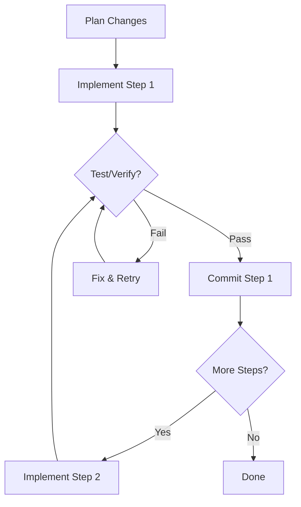

# Incremental Changes Rule

## Enforcement Level: WARN

## Rule Description

Agent PHẢI thực hiện thay đổi code theo **incremental approach** - từng bước nhỏ, test thường xuyên, commit atomic.

---

## Core Principles

### 1. Small Batches

```
❌ BAD: Change 10 files at once
✅ GOOD: Change 1-3 related files, verify, then continue
```

### 2. Test After Each Step

```
❌ BAD: Write all code, then test at the end
✅ GOOD: Write feature → Test → Verify → Next feature
```

### 3. Atomic Changes

```
❌ BAD: Mix unrelated changes in one commit
✅ GOOD: One logical change per commit
```

---

## Incremental Flow



---

## Implementation Guidelines

### Maximum Changes Per Batch

| Change Type   | Max Files        | Max Lines |
| ------------- | ---------------- | --------- |
| Bug fix       | 2-3 files        | 50 lines  |
| Small feature | 3-5 files        | 150 lines |
| Refactor      | 5-10 files       | 300 lines |
| Large feature | Break into steps | N/A       |

### Verification After Each Step

```
After modifying code:
1. Run: Lint check
2. Run: Type check (if applicable)
3. Run: Related unit tests
4. Verify: Build succeeds
```

### Rollback Strategy

If step fails:

1. Identify failing change
2. Revert to last working state
3. Re-implement with fix
4. Continue incrementally

---

## Trigger Patterns

Agent SHOULD apply this rule when:

- Implementing multi-file changes
- Adding new features
- Performing refactoring
- Fixing complex bugs

---

## Example Workflow

```
User: "Add user CRUD operations"

Agent Plan:
├── Step 1: Create User model + migration
├── Step 2: Create User repository
├── Step 3: Create User service
├── Step 4: Create User controller
└── Step 5: Add routes + tests

Execution:
Step 1: Create User model
├── Write: src/models/user.ts
├── Write: migrations/001_user.sql
├── Verify: Schema valid ✅
└── Commit: "feat(user): add User model"

Step 2: Create User repository
├── Write: src/repositories/user.ts
├── Verify: Types match ✅
└── Commit: "feat(user): add User repository"

... continue incrementally
```

---

## Benefits

| Benefit           | Description                          |
| ----------------- | ------------------------------------ |
| Easier debugging  | Small changes = easy to isolate bugs |
| Lower risk        | Rollback only affects small change   |
| Better reviews    | Atomic commits are easier to review  |
| Progress tracking | Can measure completion by steps      |

---

## Checklist

- [ ] Changes broken into small steps?
- [ ] Each step verified before next?
- [ ] Commits are atomic?
- [ ] Tests run after each step?
- [ ] Can rollback if needed?

---
