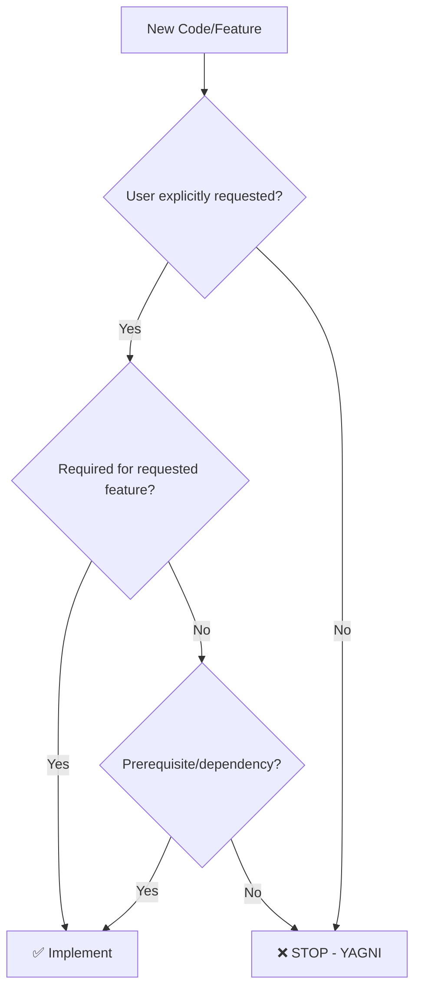

# YAGNI Enforcement Rule

## Enforcement Level: BLOCK

## Rule Description

**YAGNI = You Aren't Gonna Need It**

Agent KHÔNG ĐƯỢC thêm code cho features mà user CHƯA yêu cầu, ngay cả khi "sau này có thể cần".

---

## Core Principle

```
✅ DO: Build what is needed NOW
❌ DON'T: Build for hypothetical future needs
```

---

## YAGNI Violations

### Red Flags

| Violation             | Example                           |
| --------------------- | --------------------------------- |
| "Future-proofing"     | Adding abstraction "just in case" |
| "While I'm here"      | Adding unrelated features         |
| "Nice to have"        | Implementing extras not requested |
| "Obviously will need" | Assuming future requirements      |
| "Might be useful"     | Speculative code additions        |

### Examples

```
User: "Add login with email/password"

❌ YAGNI Violation:
├── Adding OAuth (not requested)
├── Adding password reset (not requested)
├── Adding MFA (not requested)
├── Building user management dashboard (not requested)
└── Creating admin roles (not requested)

✅ YAGNI Compliant:
└── Login with email/password only
```

---

## Decision Framework



---

## Allowed Exceptions

Code CAN be added without explicit request ONLY if:

| Exception      | Condition                           |
| -------------- | ----------------------------------- |
| Security       | Required to prevent vulnerabilities |
| Dependency     | Prerequisite for requested feature  |
| Error handling | Basic error handling for new code   |
| Validation     | Input validation for new endpoints  |

---

## Trigger Keywords

Agent MUST pause and validate when thinking:

- "Might need later"
- "Could be useful"
- "While I'm here"
- "Should also add"
- "Future-proof"
- "Obviously will need"
- "Just in case"

---

## Enforcement Actions

### When Detecting YAGNI Smell:

```
🚫 YAGNI Check Failed:
├── Feature: Password reset functionality
├── Reason: User only requested login
├── Request: "Add login with email/password"
└── Action: BLOCKED - Not implementing

💡 If you need password reset, please request it explicitly.
```

### When Compliant:

```
✅ YAGNI Check Passed:
└── Implementing: Login with email/password
    (Exactly what was requested)
```

---

## Self-Check Questions

Before adding ANY code, ask:

1. **Did user request this specifically?**
2. **Is this required for what was requested?**
3. **Am I guessing future needs?**
4. **Would the feature work without this?**

If "no" to #1 and #2, or "yes" to #3:
→ **DO NOT ADD THE CODE**

---

## Benefits of YAGNI

| Benefit         | Impact                   |
| --------------- | ------------------------ |
| Less code       | Easier to maintain       |
| Faster delivery | Build only what's needed |
| No waste        | No unused features       |
| Simpler         | Reduced complexity       |
| Focused         | Clear scope              |

---

## Integration

| Related Rule              | Purpose                  |
| ------------------------- | ------------------------ |
| `pre-check-validation.md` | Includes YAGNI as Step 1 |
| `incremental-changes.md`  | Small, focused changes   |
| `stop-conditions.md`      | Stop when YAGNI violated |

---

## Checklist

- [ ] Feature explicitly requested?
- [ ] No speculative additions?
- [ ] Not "future-proofing"?
- [ ] Minimal necessary code?
- [ ] YAGNI principle followed?

---

_DOMYH Awesome Code v4.3 — YAGNI Enforcement Rule_
