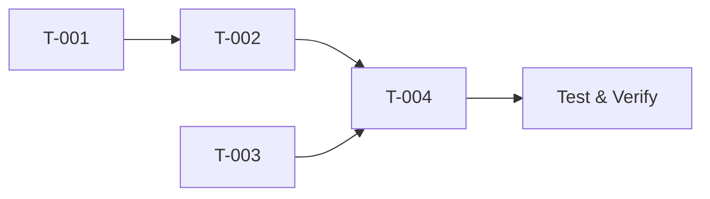

# Feature Chain — Step 3: Planning

> Task breakdown with full traceability

---

## Context

Design complete. Break down into executable tasks.

## Input

```
{{REQUIREMENTS_OUTPUT}}
{{DESIGN_OUTPUT}}
```

## Task

### 1. Task Breakdown

| ID    | Task               | Ref    | Est. | Deps  | Status |
| ----- | ------------------ | ------ | ---- | ----- | ------ |
| T-001 | [Task description] | AC-001 | S    | —     | ⬜     |
| T-002 | [Task description] | AC-001 | M    | T-001 | ⬜     |
| T-003 | [Task description] | AC-002 | S    | —     | ⬜     |

> Every task MUST reference an AC-xxx. Orphan tasks = scope creep.

### 2. Dependency Graph



### 3. Effort Summary

| Size  | Count | Total Est. |
| ----- | ----- | ---------- |
| XS    | N     | Xh         |
| S     | N     | Xh         |
| M     | N     | Xh         |
| **Σ** |       | **Xh**     |

> Include buffer: testing (+20%), review (+10%)

### 4. Milestones

- [ ] **M1**: Core logic complete (T-001..T-003)
- [ ] **M2**: Tests passing, coverage met (T-004)
- [ ] **M3**: Documentation updated (T-005)

## Output Format

```yaml
planning:
  tasks:
    - id: "T-001"
      title: "[Task]"
      ref: "AC-001"
      effort: "S"
      deps: []
    - id: "T-002"
      title: "[Task]"
      ref: "AC-001"
      effort: "M"
      deps: ["T-001"]
  total_effort: "Xh"
  milestones:
    - id: "M1"
      name: "[Name]"
      tasks: ["T-001", "T-002", "T-003"]
```

---

_Chain Step 3 of 5 • Output: planning → ⛔ STOP for approval_
