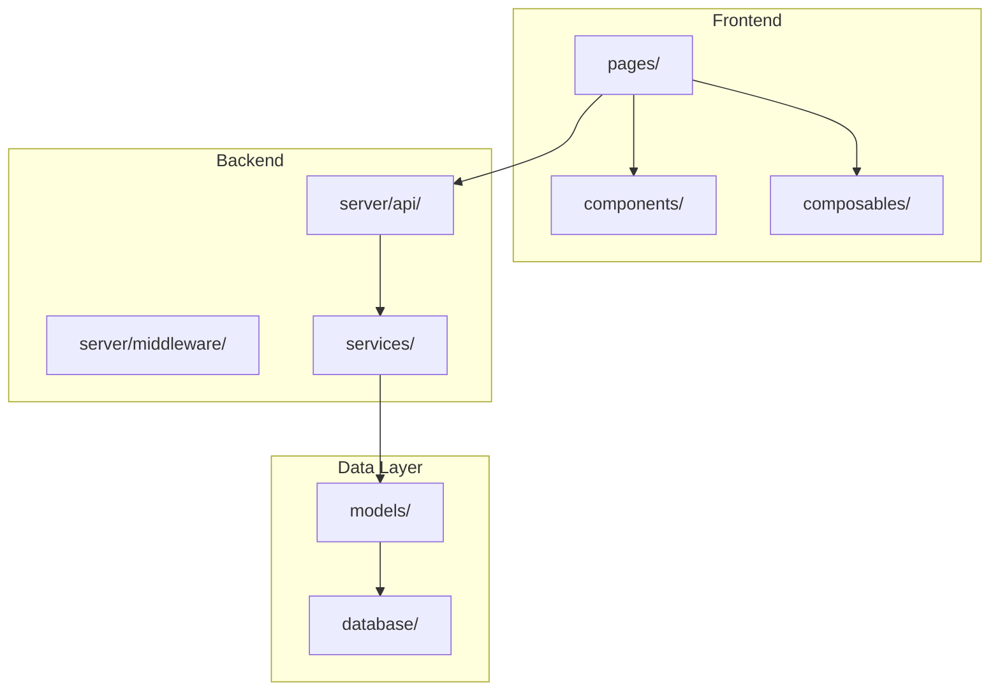

# 📦 /onboard — Project Discovery

> Understand Any Codebase in Minutes
> 📚 Architecture Mapping • Dependency Analysis • Getting Started Guide

---

## ONBOARD FLOW

1. **DETECT** — Stack detection (`hsa_detect_stack`), project snapshot (`hsa_get_snapshot`), count files/dirs, identify entry points & configs. Show: `[Step 1/6] Detecting stack...`
2. **ANALYZE** — Parse architecture: folder structure, key modules, dependency graph, build system. Use `hsa_get_repo_map` for file importance ranking. Show: `[Step 2/6] Analyzing 342 files...`
3. **MAP** — Generate Mermaid architecture diagram + module dependency graph. Show: `[Step 3/6] Mapping architecture...`
4. **ASSESS** — Identify code health: test coverage, lint score, outdated deps, known issues. Show: `[Step 4/6] Assessing code health...`
5. **GUIDE** — Create "Getting Started" guide: setup steps, key files, conventions, common tasks. Show: `[Step 5/6] Generating guide...`
6. **SYNC** — Save onboard report to `.domyh/onboard/onboard_YYYY-MM-DD.md`. Show: `[Step 6/6] Saving report...`

---

## COMMANDS

| Command                 | Description               | Output                        |
| ----------------------- | ------------------------- | ----------------------------- |
| `/onboard`              | Full project discovery    | Architecture diagram + guide  |
| `/onboard quick`        | 2-minute overview         | Stack + key files + setup     |
| `/onboard architecture` | Architecture diagram only | Mermaid diagram               |
| `/onboard deps`         | Dependency analysis       | Dep graph + outdated check    |
| `/onboard conventions`  | Coding conventions        | Detected patterns + rules     |
| `/onboard share`        | Export onboard guide      | Markdown doc for team sharing |

---

## 📊 OUTPUT FORMAT

```
📦 PROJECT ONBOARD — [project] — [date]
━━━━━━━━━━━━━━━━━━━━━━━━━━━━━━━━━━━━━━

🏗️ Stack: [detected framework + language + tools]
📁 Structure: [total files] | [total dirs] | [src LoC]
🧪 Tests: [test files] | Coverage: [%]
🔒 Security: [npm audit / cargo audit / go vuln] summary

📊 Architecture Diagram:
[Mermaid graph TD diagram of key modules]

📋 Key Files:
  • Entry: [entry point files]
  • Config: [config files]
  • API: [API route pattern]
  • State: [state management files]

🚀 Getting Started:
  1. [env setup command]
  2. [install command]
  3. [dev server command] → [URL]

📝 Conventions Detected:
  • Naming: [camelCase / snake_case / PascalCase]
  • Structure: [feature-based / layer-based]
  • Imports: [relative / alias / barrel]
```

---

## 🏗️ ARCHITECTURE MAPPING

### Auto-Generated Mermaid Diagram



### Dependency Graph

- Parse `package.json` / `go.mod` / `Cargo.toml` / `requirements.txt`
- Show: direct deps, dev deps, outdated count, vulnerability count
- Highlight: circular dependencies, unused dependencies

---

## 🔍 DETECTION RULES

### Entry Points (by framework)

| Framework  | Entry Point                       |
| ---------- | --------------------------------- |
| Next.js    | `app/page.tsx`, `pages/index.tsx` |
| Nuxt       | `app.vue`, `pages/index.vue`      |
| Vite/React | `src/main.tsx`, `src/App.tsx`     |
| Flutter    | `lib/main.dart`                   |
| Go         | `main.go`, `cmd/*/main.go`        |
| .NET       | `Program.cs`, `Startup.cs`        |
| Rust       | `src/main.rs`, `src/lib.rs`       |

### Architecture Pattern Detection

| Pattern          | Indicators                            |
| ---------------- | ------------------------------------- |
| Monolith         | Single entry, shared DB               |
| Modular Monolith | Feature folders, internal modules     |
| Microservices    | Multiple `go.mod` / `package.json`    |
| Monorepo         | `workspaces`, `nx.json`, `turbo.json` |
| Serverless       | `serverless.yml`, `netlify.toml`      |

---

## 📈 CODE HEALTH ASSESSMENT

| Metric         | Green      | Yellow     | Red         |
| -------------- | ---------- | ---------- | ----------- |
| Test Coverage  | ≥ 80%      | 50-80%     | < 50%       |
| Lint Score     | 0 errors   | < 10 warns | > 10 errors |
| Outdated Deps  | 0 major    | 1-3 major  | > 3 major   |
| Security Vulns | 0 critical | moderate   | critical    |
| Build Time     | < 30s      | 30-60s     | > 60s       |
| Bundle Size    | < 200KB    | 200-500KB  | > 500KB     |
