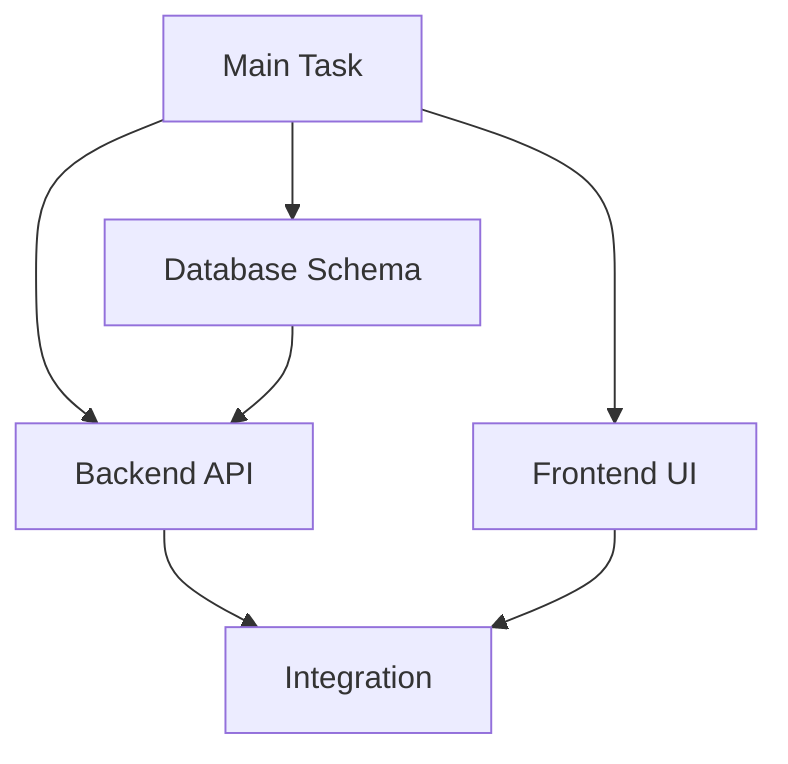

# 🎭 /orchestrate — Orchestrate Pro v3.1

> Intelligent Task Coordination
> 📚 Parallel • Delegation • Synthesis

---

## 🔄 ORCHESTRATE FLOW

```
User: /orchestrate [complex task]
    │
    ▼
┌─────────────────────────────────────────┐
│ PHASE 1: DECOMPOSE                      │
│ ▸ Break into subtasks                   │
│ ▸ Identify dependencies                 │
│ ▸ Determine parallelization             │
└─────────────────────────────────────────┘
    │
    ▼
┌─────────────────────────────────────────┐
│ PHASE 2: ASSIGN                         │
│ ▸ Match tasks to specialists            │
│ ▸ Define interfaces                     │
│ ▸ Set checkpoints                       │
└─────────────────────────────────────────┘
    │
    ▼
┌─────────────────────────────────────────┐
│ PHASE 3: EXECUTE                        │
│ ▸ Run parallel tasks                    │
│ ▸ Monitor progress                      │
│ ▸ Handle dependencies                   │
└─────────────────────────────────────────┘
    │
    ▼
┌─────────────────────────────────────────┐
│ PHASE 4: SYNTHESIZE                     │
│ ▸ Merge results                         │
│ ▸ Resolve conflicts                     │
│ ▸ Verify integration                    │
└─────────────────────────────────────────┘
```

---

## 🎯 COMMANDS

| Command               | Description             |
| --------------------- | ----------------------- |
| `/orchestrate [task]` | Coordinate complex task |
| `/orchestrate status` | Check progress          |
| `/orchestrate merge`  | Synthesize results      |

---

## 📊 ORCHESTRATION PLAN

````markdown
🎭 ORCHESTRATION PLAN

━━━━━━━━━━━━━━━━━━━━━━━━━━━━━━━━━━━━━━━━━

Task: {Complex Task Description}

## Decomposition


````

## Subtasks

| ID  | Task            | Specialist   | Status | Depends |
| --- | --------------- | ------------ | ------ | ------- |
| T1  | Database schema | DB Expert    | 🟢     | -       |
| T2  | Backend API     | Backend Dev  | 🟡     | T1      |
| T3  | Frontend UI     | Frontend Dev | 🟡     | -       |
| T4  | Integration     | Full-stack   | ⏳     | T2, T3  |
| T5  | Testing         | QA           | ⏳     | T4      |

## Parallel Execution

```
Timeline:
─────────────────────────────────────────
T1 ████████░░░░░░░░░░░░░░░░░░░░░░░░░░░░
T2 ░░░░░░░░████████████░░░░░░░░░░░░░░░░
T3 ████████████████████░░░░░░░░░░░░░░░░
T4 ░░░░░░░░░░░░░░░░░░░░████████░░░░░░░░
T5 ░░░░░░░░░░░░░░░░░░░░░░░░░░░░████████
─────────────────────────────────────────
    Day 1    Day 2    Day 3    Day 4
```

## Interfaces

| From    | To                | Contract          |
| ------- | ----------------- | ----------------- |
| T1 → T2 | DB → API          | Schema definition |
| T2 → T4 | API → Integration | API endpoints     |
| T3 → T4 | UI → Integration  | Component props   |

## Checkpoints

| Checkpoint | Gate               | Owner |
| ---------- | ------------------ | ----- |
| CP1        | Schema approved    | T1    |
| CP2        | API docs reviewed  | T2    |
| CP3        | UI components done | T3    |
| CP4        | Integration tested | T4    |

━━━━━━━━━━━━━━━━━━━━━━━━━━━━━━━━━━━━━━━━━

⛔ Approve plan? [y/n]

````

---

## 🔧 SPECIALIST ROLES

```yaml
specialists:
  backend:
    skills: [api, database, security]
    commands: [/code, /test, /debug]

  frontend:
    skills: [ui, ux, components]
    commands: [/code, /visualize]

  devops:
    skills: [deploy, infra, monitoring]
    commands: [/deploy, /monitor, /env]

  qa:
    skills: [testing, automation]
    commands: [/test, /review]

  architect:
    skills: [design, patterns, decisions]
    commands: [/plan, /think]
````

---

## 📋 COORDINATION PATTERNS

```yaml
patterns:
  # Parallel independent tasks
  parallel:
    when: "No dependencies between tasks"
    strategy: "Run simultaneously, merge at end"

  # Sequential with dependencies
  pipeline:
    when: "Output of A is input to B"
    strategy: "Strict ordering, checkpoints"

  # Fan-out/fan-in
  scatter_gather:
    when: "Same task, different data"
    strategy: "Distribute, collect, aggregate"

  # Iterative refinement
  feedback_loop:
    when: "Requires multiple passes"
    strategy: "Draft → Review → Refine → Repeat"
```

---

## ⚡ PARALLEL EXECUTION PATTERNS

```yaml
parallel_patterns:
  orchestrator_worker:
    description: "Lead agent delegates to sub-agents"
    pattern: 1. "Decompose complex task"
      2. "Assign to specialists"
      3. "Execute in parallel"
      4. "Aggregate results"
      5. "Synthesize output"

  concurrency_limits:
    default: 3
    max: 5
    rationale: "Avoid rate limits, diminishing returns"

  resource_contention:
    detection: "Track rate limits, locks"
    strategy: "Exponential backoff"

  command: "/orchestrate parallel [task_list]"
```

---

## 🛡️ FAULT TOLERANCE

```yaml
fault_tolerance:
  strategies:
    retry_failed:
      description: "Retry individual subtasks"
      max_attempts: 3
      backoff: "exponential"

    checkpoint:
      description: "Save state for resume"
      trigger: "After each subtask complete"

    fallback:
      description: "Alternative agent path"
      use_when: "Primary agent fails"

    circuit_breaker:
      description: "Stop on repeated failures"
      threshold: "3 failures in 5 attempts"

  recovery:
    command: "/orchestrate resume [checkpoint_id]"
    restore: "Continue from last good state"
```

---

## 🎯 TOKEN BOUNDARY MANAGEMENT

```yaml
token_boundaries:
  rules:
    per_agent_limit: "Set explicit token caps"
    timeout: "Max execution time per task"
    loop_prevention: "Detect recursive patterns"

  monitoring:
    per_agent_usage: true
    alert_threshold: "90% of limit"
    log_granularity: "Track per-agent metrics"

  anti_patterns:
    - "Unlimited agent conversations"
    - "No timeout boundaries"
    - "Shared context explosions"
    - "Recursive loops without exit"
```

---

## 🤝 CONSENSUS MECHANISMS

```yaml
consensus:
  description: "Multi-agent agreement before action"

  use_cases:
    - "High-risk decisions"
    - "Conflicting recommendations"
    - "Production deployments"

  mechanisms:
    voting:
      pattern: "Majority vote (3+ agents)"
      threshold: ">= 2/3 agreement"

    confidence:
      pattern: "Average confidence score"
      threshold: ">= 0.8"

  command: "/orchestrate consensus [decision]"
```

---

## 📊 PROGRESS TRACKING

```markdown
## Progress

| Task | Progress             | ETA |
| ---- | -------------------- | --- |
| T1   | ████████████░░░░ 75% | 2h  |
| T2   | ████████░░░░░░░░ 50% | 4h  |
| T3   | ██████████████░░ 90% | 1h  |

Overall: ████████░░░░░░░░ 52%
```

---

## ⚙️ TOKEN OPTIMIZATION

```yaml
token_saving:
  - Focus on coordination
  - Delegate details to subtasks
  - Summary-level tracking
```

---

_DOMYH Awesome Code v6.1.2 • Orchestrate Pro v3.1 • Fault-Tolerant Multi-Agent_
