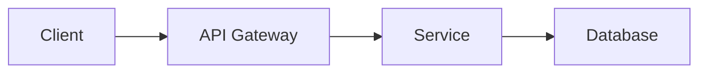

# 📋 /plan — Plan Pro v3.2

> Outcome-Focused Feature Planning
> 📚 OKRs • Impact Analysis • Agile Estimation

---

## 🔄 PLANNING FLOW

```
User: /plan [feature description]
    │
    ▼
┌─────────────────────────────────────────┐
│ PHASE 0: DEEP INTERVIEW ⭐ (AWF v6.1.2)   │
│ ▸ 3 Câu Hỏi Vàng (nếu cần)              │
│ ▸ Xác định scope & priority             │
│ ⛔ SKIP nếu user đã cung cấp đủ context │
└─────────────────────────────────────────┘
    │
    ▼
┌─────────────────────────────────────────┐
│ PHASE 1: UNDERSTAND                     │
│ ▸ Clarify requirements                  │
│ ▸ Define success criteria               │
│ ▸ Identify stakeholders                 │
│ ⛔ STOP → Clarify if unclear            │
└─────────────────────────────────────────┘
    │
    ▼
┌─────────────────────────────────────────┐
│ PHASE 2: ANALYZE                        │
│ ▸ Assess impact & dependencies          │
│ ▸ Identify risks                        │
│ ▸ Evaluate alternatives                 │
└─────────────────────────────────────────┘
    │
    ▼
┌─────────────────────────────────────────┐
│ PHASE 3: DESIGN                         │
│ ▸ Technical approach                    │
│ ▸ Architecture decisions                │
│ ▸ API design                            │
└─────────────────────────────────────────┘
    │
    ▼
┌─────────────────────────────────────────┐
│ PHASE 4: BREAKDOWN                      │
│ ▸ Task decomposition                    │
│ ▸ Effort estimation                     │
│ ▸ Dependency mapping                    │
└─────────────────────────────────────────┘
    │
    ▼
┌─────────────────────────────────────────┐
│ PHASE 5: VALIDATE                       │
│ ▸ Review with user                      │
│ ⛔ STOP → Confirm before proceed        │
└─────────────────────────────────────────┘
```

---

## 🎯 COMMANDS

| Command           | Description          | Focus           |
| ----------------- | -------------------- | --------------- |
| `/plan [feature]` | Full planning        | Complete flow   |
| `/plan full`      | Full + Phase Folders | Auto-tạo plans/ |
| `/plan quick`     | Quick estimate       | Time-boxed      |
| `/plan tech`      | Technical design     | Architecture    |
| `/plan breakdown` | Task list only       | Estimation      |
| `/plan risk`      | Risk analysis        | Risks focus     |

---

## 📋 PHASE 0: DEEP INTERVIEW ⭐ (AWF v6.1.2)

> **Mục đích**: Thu thập đủ context TRƯỚC khi đề xuất giải pháp
> **Skip nếu**: User đã cung cấp đủ thông tin trong request

### 3 Câu Hỏi Vàng

```yaml
golden_questions:
  1_what:
    question: "Feature này xử lý/quản lý cái gì chính xác?"
    purpose: "Xác định domain và scope"
    skip_if: "Request đã rõ ràng (e.g., 'thêm auth JWT')"

  2_who:
    question: "Ai sử dụng? □ Solo | □ Team (2-10) | □ Public"
    purpose: "Xác định scale và security level"
    skip_if: "Context đã có (existing project)"

  3_priority:
    question: "Nếu chỉ làm 1 việc duy nhất, đó là gì?"
    purpose: "Xác định MVP scope"
    skip_if: "Request đã specific"
```

### Output Template

```markdown
🎯 DEEP INTERVIEW SUMMARY

Feature: {tên feature}
Target: □ Solo | □ Team | □ Public
MVP Priority: {1 việc quan trọng nhất}

→ Đủ context, tiến hành PHASE 1...
```

### Skip Conditions

```yaml
auto_skip:
  - "Request đã có đủ What/Who/Priority"
  - "Existing project có context rõ ràng"
  - "User gọi /plan quick (skip interview)"
  - "Follow-up từ /think đã có brief"
```

---

## 📋 PHASE 1: UNDERSTAND

### Requirements Template:

```markdown
📝 FEATURE REQUEST

━━━━━━━━━━━━━━━━━━━━━━━━━━━━━━━━━━━━━━━━━

Feature: {feature_name}
Type: [New Feature | Enhancement | Bug Fix | Refactor]

**What:**
{Clear description of the feature}

**Why (Business Value):**
{Problem being solved, user benefit, KPI impact}

**Who (Stakeholders):**
├── Users: {affected user types}
├── Systems: {affected services/APIs}
└── Teams: {involved teams}

**Success Criteria:**

- [ ] {Measurable outcome 1}
- [ ] {Measurable outcome 2}
- [ ] {Measurable outcome 3}

**Constraints:**
├── Timeline: {deadline if any}
├── Budget: {resource constraints}
└── Technical: {platform/compatibility}

━━━━━━━━━━━━━━━━━━━━━━━━━━━━━━━━━━━━━━━━━

⛔ Unclear → STOP, clarify requirements
```

### Clarification Questions:

```yaml
clarification:
  scope:
    - "Should this work for all users or specific roles?"
    - "Is mobile support required?"
    - "What's the minimum viable scope?"

  technical:
    - "Any existing code to reuse?"
    - "Integration with external services?"
    - "Performance requirements?"

  business:
    - "Priority compared to other work?"
    - "Hard deadline or flexible?"
    - "Metrics to track success?"
```

---

## 📋 PHASE 2: ANALYZE

### Impact Assessment:

```markdown
🔍 IMPACT ANALYSIS

━━━━━━━━━━━━━━━━━━━━━━━━━━━━━━━━━━━━━━━━━

| Factor              | Assessment      | Notes            |
| ------------------- | --------------- | ---------------- |
| **Business Impact** | High/Medium/Low | {justification}  |
| **User Impact**     | High/Medium/Low | {affected users} |
| **Technical Risk**  | High/Medium/Low | {complexity}     |
| **Effort**          | XS/S/M/L/XL     | {estimate}       |
| **Dependencies**    | {count}         | {list}           |

Affected Components:
├── Backend: {services}
├── Frontend: {pages/components}
├── Database: {tables/schemas}
└── Infrastructure: {changes}

External Dependencies:
├── {dependency_1}: {status}
└── {dependency_2}: {status}

━━━━━━━━━━━━━━━━━━━━━━━━━━━━━━━━━━━━━━━━━
```

### Risk Analysis:

```markdown
⚠️ RISK ASSESSMENT

━━━━━━━━━━━━━━━━━━━━━━━━━━━━━━━━━━━━━━━━━

| Risk     | Probability  | Impact       | Mitigation |
| -------- | ------------ | ------------ | ---------- |
| {risk_1} | High/Med/Low | High/Med/Low | {strategy} |
| {risk_2} | High/Med/Low | High/Med/Low | {strategy} |
| {risk_3} | High/Med/Low | High/Med/Low | {strategy} |

Risk Matrix:
┌─────────────────────────────────┐
│ High │ 🟡 │ 🔴 │ 🔴 │
│ Impact Med │ 🟢 │ 🟡 │ 🔴 │
│ Low │ 🟢 │ 🟢 │ 🟡 │
└─────────────│ Low │ Med │High │
└─────────────────┘
Probability

Total Risk Score: {Low/Medium/High}

━━━━━━━━━━━━━━━━━━━━━━━━━━━━━━━━━━━━━━━━━
```

### Alternatives Analysis:

```markdown
🔄 ALTERNATIVES CONSIDERED

━━━━━━━━━━━━━━━━━━━━━━━━━━━━━━━━━━━━━━━━━

Option A: {approach_1}
├── ✅ Pros: {benefits}
├── ❌ Cons: {drawbacks}
└── Effort: {estimate}

Option B: {approach_2}
├── ✅ Pros: {benefits}
├── ❌ Cons: {drawbacks}
└── Effort: {estimate}

Option C: {approach_3} (if applicable)
├── ✅ Pros: {benefits}
├── ❌ Cons: {drawbacks}
└── Effort: {estimate}

⭐ Recommended: Option {X}
Reason: {justification}

━━━━━━━━━━━━━━━━━━━━━━━━━━━━━━━━━━━━━━━━━
```

---

## 📋 PHASE 3: DESIGN

### Technical Design:

````markdown
🏗️ TECHNICAL DESIGN

━━━━━━━━━━━━━━━━━━━━━━━━━━━━━━━━━━━━━━━━━

## Approach

{High-level description of the solution}

## Architecture


````

## Components

| Component     | Responsibility | Changes      |
| ------------- | -------------- | ------------ |
| {component_1} | {what it does} | {New/Modify} |
| {component_2} | {what it does} | {New/Modify} |
| {component_3} | {what it does} | {New/Modify} |

## Data Model

```sql
-- New table or changes
CREATE TABLE {table_name} (
    id UUID PRIMARY KEY,
    {field_1} {type},
    {field_2} {type}
);
```

## API Design

```yaml
# New endpoints
POST /api/v1/{resource}
  Request: { field1, field2 }
  Response: { id, created_at }

GET /api/v1/{resource}/{id}
  Response: { id, field1, field2 }
```

## Trade-offs

| Decision     | Rationale |
| ------------ | --------- |
| {decision_1} | {why}     |
| {decision_2} | {why}     |

━━━━━━━━━━━━━━━━━━━━━━━━━━━━━━━━━━━━━━━━━

````

---

## 📋 PHASE 4: BREAKDOWN

### Task Breakdown:

```markdown
📋 TASK BREAKDOWN

━━━━━━━━━━━━━━━━━━━━━━━━━━━━━━━━━━━━━━━━━

## Backend Tasks

| # | Task | Effort | Dep | Owner |
|---|------|--------|-----|-------|
| B1 | Create database migration | S | - | - |
| B2 | Implement repository layer | M | B1 | - |
| B3 | Implement service layer | M | B2 | - |
| B4 | Create API endpoints | M | B3 | - |
| B5 | Add validation & error handling | S | B4 | - |
| B6 | Write unit tests | M | B5 | - |
| B7 | Write integration tests | M | B6 | - |

## Frontend Tasks (if applicable)

| # | Task | Effort | Dep | Owner |
|---|------|--------|-----|-------|
| F1 | Create UI components | M | - | - |
| F2 | Implement API integration | S | B4 | - |
| F3 | Add form validation | S | F2 | - |
| F4 | Write component tests | S | F3 | - |

## Infrastructure Tasks (if applicable)

| # | Task | Effort | Dep | Owner |
|---|------|--------|-----|-------|
| I1 | Update CI/CD pipeline | S | - | - |
| I2 | Add monitoring/alerts | S | B7 | - |

━━━━━━━━━━━━━━━━━━━━━━━━━━━━━━━━━━━━━━━━━
````

### Effort Scale:

```yaml
effort_scale:
  XS: "< 1 hour"
  S: "1-4 hours"
  M: "4-8 hours (1 day)"
  L: "2-3 days"
  XL: "1 week"
  XXL: "2+ weeks (needs breakdown)"

estimation_rules:
  - Include testing time (20-30% of dev)
  - Add buffer for unknowns (10-20%)
  - Account for code review
  - Consider integration complexity
```

### Summary:

```markdown
📊 PLANNING SUMMARY

━━━━━━━━━━━━━━━━━━━━━━━━━━━━━━━━━━━━━━━━━

Feature: {feature_name}

Timeline:
├── Total Tasks: {count}
├── Estimated Effort: {X} days
├── With Buffer (+20%): {Y} days
└── Target Completion: {date}

By Component:
├── Backend: {X} days
├── Frontend: {Y} days
├── Testing: {Z} days
└── Infrastructure: {W} days

Critical Path:
B1 → B2 → B3 → B4 → F2 → F3

Blockers/Dependencies:
├── {dependency_1}: {status}
└── {dependency_2}: {status}

━━━━━━━━━━━━━━━━━━━━━━━━━━━━━━━━━━━━━━━━━

⛔ CONFIRM PLAN?
1️⃣ Approve and start coding
2️⃣ Revise estimates
3️⃣ Change approach
4️⃣ Request more details

Enter number:
```

---

## 🔧 PLANNING FRAMEWORKS

### Now-Next-Later:

```yaml
now_next_later:
  now:
    description: "Current sprint (1-2 weeks)"
    detail_level: "Full breakdown, assigned"

  next:
    description: "Next 1-3 sprints"
    detail_level: "Rough estimates, not assigned"

  later:
    description: "Backlog (3+ months)"
    detail_level: "Ideas only, unprioritized"
```

### RICE Scoring:

```yaml
rice:
  formula: "(Reach × Impact × Confidence) / Effort"

  reach:
    description: "How many users affected per quarter"
    scale: "Actual number (100, 1000, 10000)"

  impact:
    description: "Impact on each user"
    scale: "3=Massive, 2=High, 1=Medium, 0.5=Low, 0.25=Minimal"

  confidence:
    description: "How confident in estimates"
    scale: "100%=High, 80%=Medium, 50%=Low"

  effort:
    description: "Person-months"
    scale: "0.5, 1, 2, 3, etc."
```

### MoSCoW Prioritization:

```yaml
moscow:
  must_have: "Critical for release"
  should_have: "Important but not vital"
  could_have: "Nice to have"
  wont_have: "Out of scope for now"
```

---

## 📋 STACK-SPECIFIC TEMPLATES

### Backend Planning:

```yaml
backend:
  go:
    layers: [handler, service, repository]
    patterns: [clean, hexagonal, ddd]
    testing: [testify, gomock]

  typescript:
    layers: [controller, service, repository]
    patterns: [mvc, clean, modular]
    testing: [jest, vitest]

  python:
    layers: [router, service, repository]
    patterns: [fastapi, django]
    testing: [pytest]
```

### Frontend Planning:

```yaml
frontend:
  react:
    structure: [pages, components, hooks, utils]
    state: [zustand, jotai, redux]
    testing: [vitest, playwright]

  vue:
    structure: [views, components, composables]
    state: [pinia]
    testing: [vitest, cypress]
```

---

## 🤖 AI-ASSISTED ESTIMATION

```yaml
ai_estimation:
  approach: "AI as estimation co-pilot"
  human_oversight: required

  hybrid_model:
    zero_point:
      description: "Fully automated tasks"
      estimate: "0 points - no human effort"
      examples: ["auto-formatting", "lint fixes"]

    standard:
      description: "Human-led work"
      estimate: "Traditional story points"
      techniques: ["Planning Poker", "T-shirt sizing"]

    review_integration:
      description: "R&I tasks for AI validation"
      estimate: "Points for review/integrate AI output"
      examples: ["code review of AI PR", "test AI suggestions"]

  commands:
    estimate: "/plan estimate [feature]"
    breakdown: "/plan breakdown [epic]"
    compare: "/plan compare [history]"
```

---

## 📊 NOESTIMATES FLOW

```yaml
noestimates:
  philosophy: "Flow efficiency over precise estimates"

  focus_metrics:
    cycle_time:
      description: "Start to done"
      target: "< 3 days for most items"

    throughput:
      description: "Items per week"
      tracking: "Rolling 4-week average"

    lead_time:
      description: "Request to delivery"
      visibility: "Customer-facing"

  benefits:
    - "Reduces estimation meetings"
    - "Focus on delivery speed"
    - "Predictable forecasting"

  commands:
    flow: "/plan flow [sprint]"
    forecast: "/plan forecast [n_items]"
```

---

## ⚡ AUTO TASK BREAKDOWN

```yaml
auto_breakdown:
  description: "AI decomposes features into atomic tasks"

  workflow:
    1_parse: "Analyze feature description"
    2_identify: "Find affected components"
    3_generate: "Create subtask list"
    4_estimate: "Complexity per task"
    5_dependencies: "Map relationships"

  commands:
    auto: "/plan auto [description]"
    refine: "/plan refine [task_id]"
```

---

## 📁 PHASE 6: AUTO PHASE GENERATION ⭐ (AWF v6.1.2)

> **Trigger**: `/plan full [feature]`
> **Mục đích**: Tự động tạo folder và phase files theo complexity

### On-Demand Folder Creation

```yaml
on_plan_full:
  step_1: "Detect project root (.git hoặc package.json)"
  step_2: "IF plans/ chưa tồn tại → Create plans/"
  step_3: "Create plans/[YYMMDD]-[feature-name]/"
  step_4: "Generate phase files based on complexity"
  step_5: "Update state.json phase_progress"
```

### Complexity Detection

```yaml
complexity_rules:
  simple:
    tasks: "< 5"
    phases: 1-2
    example: "Add a button, fix a bug"

  medium:
    tasks: "5-15"
    phases: 3-4
    example: "New API endpoint, refactor module"

  complex:
    tasks: "15+"
    phases: 5+
    example: "New feature system, major refactor"
```

### Output Structure (On-Demand)

```
plans/                              # Tạo lần đầu /plan full
└── 260203-user-authentication/     # Tạo theo feature
    ├── plan.md                     # Overview + Progress bar
    ├── phase-01-setup.md           # Bootstrap
    ├── phase-02-core.md            # Core logic
    └── phase-03-testing.md         # Testing (nếu medium+)
```

### Progress Bar (state.json)

```json
{
  "phase_progress": {
    "active_plan": "plans/260203-user-authentication",
    "current_phase": "phase-02-core",
    "total_phases": 3,
    "completed_phases": 1,
    "tasks": { "total": 8, "completed": 3 }
  }
}
```

### Display Format (~15 tokens)

```
📊 ████████░░░░ 67% (2/3 phases, 5/8 tasks)
```

---

## ⚙️ TOKEN OPTIMIZATION

```yaml
token_saving:
  # Quick planning
  - Use templates
  - Focus on deltas from standard patterns

  # Efficient output
  - Tables over prose
  - Mermaid diagrams
  - Concise descriptions
```

---

## 📜 RULES APPLIED

| Phase      | Rules                |
| ---------- | -------------------- |
| Interview  | `stop-conditions`    |
| Understand | `stop-conditions`    |
| Analyze    | `context-management` |
| Design     | `edit-verification`  |
| Breakdown  | `evidence`           |
| Validate   | `stop-conditions`    |
| Generate   | `on-demand`          |

---

_DOMYH Awesome Code v6.1.2 • Plan Pro v3.2 • Deep Interview + Auto Phase Generation_
