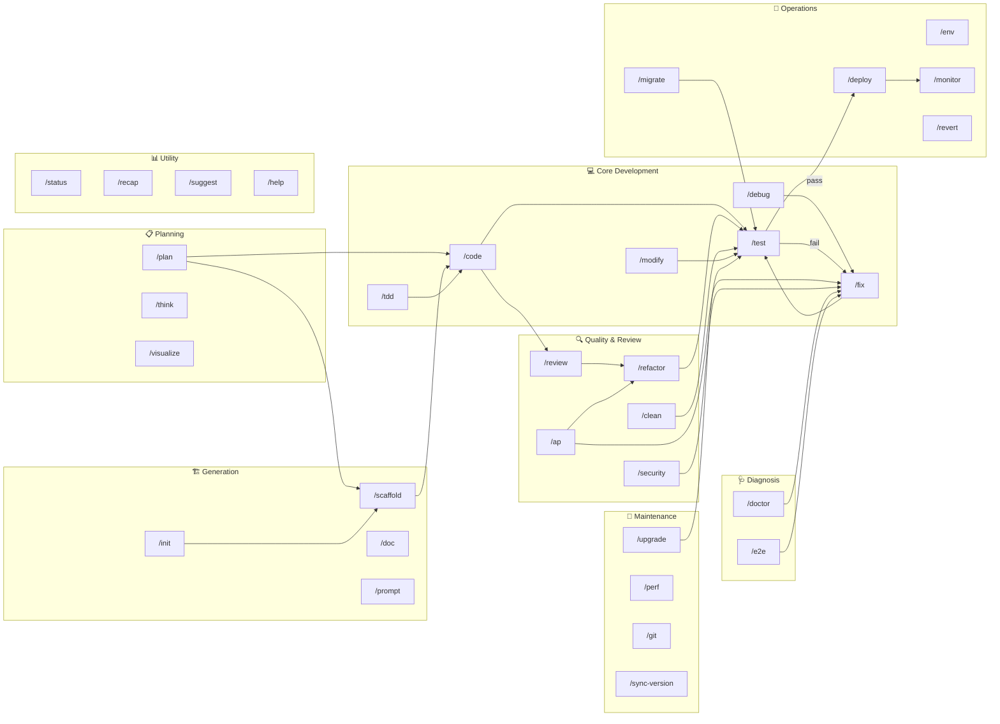
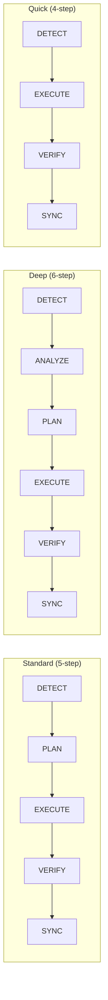

# 🔄 /workflow — Workflow Meta

> Discover, Chain, and Manage Workflows
> 📚 Discovery • Chaining • Aliases • Context-Aware • DAG Execution

---

## COMMANDS

| Command                       | Description                              |
| ----------------------------- | ---------------------------------------- |
| `/workflow list`              | List all available workflows by category |
| `/workflow list [category]`   | List workflows in specific category      |
| `/workflow chain [a] [b] [c]` | Execute workflows in sequence            |
| `/workflow suggest`           | Suggest next workflow based on context   |
| `/workflow recent`            | Show recently used workflows             |
| `/workflow info [cmd]`        | Show detailed info about a workflow      |
| `/workflow dag [a] [b] [c]`   | Execute with dependency awareness        |

---

## 📋 WORKFLOW CATEGORIES

| Category    | Label                  | Commands                                                       |
| ----------- | ---------------------- | -------------------------------------------------------------- |
| core        | 💻 Core Development    | `/code`, `/debug`, `/fix`, `/test`, `/modify`, `/tdd`          |
| quality     | 🔍 Quality & Review    | `/ap`, `/review`, `/refactor`, `/security`, `/clean`           |
| planning    | 📋 Planning & Thinking | `/plan`, `/think`, `/visualize`                                |
| generation  | 🏗️ Generation          | `/init`, `/scaffold` (= `/generate`), `/doc`, `/prompt`        |
| operations  | 🚀 Operations          | `/deploy`, `/env`, `/migrate`, `/monitor`, `/revert`           |
| maintenance | 🔧 Maintenance         | `/upgrade`, `/perf`, `/git`, `/sync-version`                   |
| utility     | 📊 Utility             | `/status`, `/recap`, `/suggest`, `/help`                       |
| onboarding  | 📦 Onboarding          | `/onboard`                                                     |
| diagnosis   | 🩺 Diagnosis           | `/doctor`, `/e2e`                                              |
| meta        | 🔄 Meta                | `/workflow`, `/orchestrate`                                    |

---

## 🗺️ MASTER FLOW MAP

---

## 🔄 CANONICAL FLOW PATTERNS

| Variant              | Workflows                                                                                                                |
| -------------------- | ------------------------------------------------------------------------------------------------------------------------ |
| **Standard** (5-6-step) | `/code`, `/refactor`, `/scaffold`, `/env`, `/migrate`, `/monitor`, `/revert`, `/visualize`, `/doc`, `/prompt`, `/clean`, `/security`, `/e2e` |
| **Deep** (6-step)     | `/ap`, `/debug`, `/plan`, `/test`, `/perf`, `/review`, `/modify`                                                         |
| **Quick** (3-4-step)  | `/fix`, `/dev`, `/git`, `/recap`, `/help`, `/generate`, `/sync-version`                                                  |
| **Report** (3-step)   | `/status`, `/doctor`                                                                                                     |
| **Unique**            | `/think` (decision), `/orchestrate` (DAG), `/init` (interview), `/deploy` (7-step ops), `/tdd` (Red-Green-Refactor), `/upgrade` (6-step safe/major), `/suggest` (context-aware), `/onboard` (discovery) |

---

## 🔗 WORKFLOW CHAINS

Run multiple workflows in sequence with data passing between them.

| Chain          | Flow                                                    | Usage                                                                                         |
| -------------- | ------------------------------------------------------- | --------------------------------------------------------------------------------------------- |
| Full Feature   | `/plan → /code → /test → /deploy`                       | `/workflow chain plan code test deploy`                                                       |
| Bug Fix        | `/debug → /fix → /test`                                 | `/workflow chain debug fix test`                                                              |
| Code Review    | `/review → /refactor → /test`                           | `/workflow chain review refactor test`                                                        |
| Quick Ship     | `/fix → /test → /git commit → /deploy`                  | `/workflow chain fix test git deploy`                                                         |
| New Feature    | `/scaffold → /code → /test`                             | `/workflow chain scaffold code test`                                                          |
| Quality Sweep  | `/ap → /refactor → /clean → /test`                      | `/workflow chain ap refactor clean test`                                                      |
| Security Gate  | `/security → /fix → /test → /deploy`                    | `/workflow chain security fix test deploy`                                                    |
| Release        | `/test → /status → /deploy → /monitor`                  | `/workflow chain test status deploy monitor`                                                  |
| Enterprise     | Full 8-stage SDLC chain                                 | `/workflow chain plan-specify code review test test-uat deploy-staging deploy deploy-signoff` |
| 🆕 Kickstart   | `/init → /env → /dev → /plan`                           | `/workflow chain init env dev plan` — New project from scratch                                |
| 🆕 Discovery   | `/status → /ap quick → /doc readme → /suggest`          | `/workflow chain status ap doc suggest` — Onboard existing project                            |
| 🆕 UI Flow     | `/think → /visualize → /scaffold → /code → /test`       | `/workflow chain think visualize scaffold code test` — Design → Code                          |
| 🆕 UI Refactor | `/visualize compare → /refactor ui → /test → /review`   | `/workflow chain visualize refactor test review` — Modernize UI                               |
| 🆕 Mobile App  | `/init → /visualize mobile → /scaffold → /code → /test` | `/workflow chain init visualize scaffold code test` — Mobile app                              |
| 🆕 Maintain    | `/status → /upgrade → /test → /deploy`                   | `/workflow chain status upgrade test deploy` — Dependency maintenance                         |
| 🆕 TDD Feature | `/plan → /tdd → /verify → /deploy`                       | `/workflow chain plan tdd verify deploy` — Test-first development                             |
| 🆕 Full Audit  | `/doctor → /ap → /refactor → /clean → /test → /security` | `/workflow chain doctor ap refactor clean test security` — Complete quality sweep              |
| 🆕 Orch Deploy | `/orchestrate → /verify → /deploy`                        | `/workflow chain orchestrate verify deploy` — Multi-domain orchestrated release               |

---

## 💡 SMART SUGGESTIONS

| After                | Suggest Next                    |
| -------------------- | ------------------------------- |
| `/init`              | → `/env`, `/dev`, `/scaffold`   |
| `/code`              | → `/test`, `/review`            |
| `/debug`             | → `/fix`, `/test`               |
| `/fix`               | → `/test`, `/git commit`        |
| `/test` pass         | → `/git commit`, `/deploy`      |
| `/test` fail         | → `/fix`, `/debug`              |
| `/review`            | → `/refactor`, `/code fix`      |
| `/refactor`          | → `/test`                       |
| `/deploy`            | → `/monitor`, `/status`         |
| `/plan`              | → `/code`, `/scaffold`          |
| `/scaffold`          | → `/code`                       |
| `/ap`                | → `/refactor`, `/fix`           |
| `/ap` score < 7      | → `/fix`, `/refactor`           |
| `/migrate`           | → `/test`, `/deploy`            |
| `/security`          | → `/fix`, `/ap`                 |
| `/security` pass     | → `/deploy`                     |
| `/onboard`           | → `/plan`, `/code`, `/suggest`  |
| `/visualize`         | → `/scaffold`, `/code`          |
| CSS/UI files changed | → `/visualize responsive`       |
| `--dark-mode` flag   | → `/visualize dark-mode`        |
| New project opened   | → `discovery` chain             |
| `/refactor ui`       | → `/test`, `/visualize compare` |
| `/modify`            | → `/test`, `/review`            |
| `/feature`           | → `/test`, `/deploy`            |
| `/tdd`               | → `/code`, `/test`              |
| `/clean`             | → `/test`, `/verify`            |
| `/e2e`               | → `/fix`, `/deploy`             |
| `/upgrade`           | → `/test`, `/deploy`            |
| `/verify` pass       | → `/git commit`, `/deploy`      |
| `/verify` fail       | → `/fix`, `/debug`              |
| `/doctor`            | → `/fix`, `/env`                |
| `/prompt`            | → `/code`, `/plan`              |
| `/perf`              | → `/refactor`, `/deploy`        |
| `/recap`             | → `/suggest`, `/plan`           |
| `/orchestrate` done  | → `/recap`, `/deploy`, `/test`  |
| `/orchestrate` fail  | → `/debug`, `/orchestrate resume`|
| Task spans 3+ domains| → `/orchestrate` (auto-scored)  |

---

## 🔄 CHAIN BEHAVIOR

| Feature        | Description                               |
| -------------- | ----------------------------------------- |
| Data passing   | Output of step N → input of step N+1      |
| Error handling | Stop chain on failure, show at which step |
| Skip logic     | Skip steps if preconditions already met   |
| Progress       | Show: `[Chain 2/4] Running /test...`      |
| Rollback       | Option to undo on chain failure           |

---

## 💾 SESSION SAVE

After completing this workflow:
1. Update `memory/CONTEXT_SNAPSHOT.md` - what changed, current status
2. Append summary to `memory/session.md`
